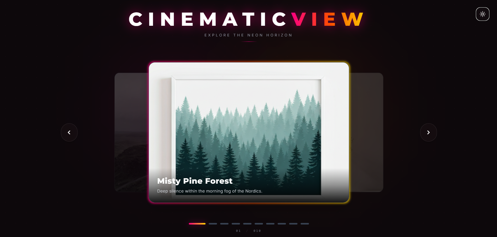
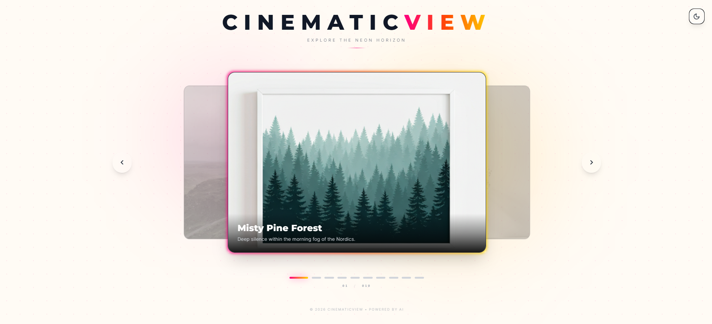

# ✨ CinematicView




> **Explore the Neon Horizon.** A high-end, 3D-perspective cinematic image carousel featuring neon aesthetics, dynamic parallax effects, and AI-powered image insights.

## 📖 Overview

**CinematicView** is a modern React application that demonstrates advanced UI/UX techniques. It moves beyond standard sliders by implementing a 3D parallax carousel that reacts to mouse and touch inputs.

Beyond visuals, it integrates **Google's Gemini AI** to provide contextual insights about the images, utilizing Google Search grounding to fetch real-time data about the landscapes displayed.

## 🚀 Key Features

* **3D Parallax Carousel:** Custom-built carousel logic that tilts and moves slides based on cursor position for an immersive depth effect.
* **🤖 AI-Powered Insights:** Integrated **Gemini 2.0 Flash (Preview)** with Google Search grounding. Ask questions about any slide, and the AI provides detailed answers with source citations.
* **🎨 Dynamic Theming:** Smooth transitions between a "Neon Dark" mode and a "Minimalist Light" mode.
* **⚡ Modern Tech Stack:** Built with React 19, TypeScript, and Vite for blazing-fast performance.
* **Responsive Design:** Fully optimized for desktop (mouse hover effects) and mobile (touch swipe gestures).

## 🛠️ Tech Stack

* **Framework:** [React 19](https://react.dev/)
* **Build Tool:** [Vite](https://vitejs.dev/)
* **Language:** [TypeScript](https://www.typescriptlang.org/)
* **Styling:** [Tailwind CSS](https://tailwindcss.com/)
* **AI:** [Google GenAI SDK](https://www.npmjs.com/package/@google/genai)
* **Icons:** [Lucide React](https://lucide.dev/) & Material Icons

## 📸 Screenshots

| Dark Mode (Neon) | Light Mode (Serenity) |
| :---: | :---: |
|  |  |

## 📂 Project Structure

```text
src/
├── components/
│   ├── AISearch.tsx       # Floating AI search bar with result panel
│   ├── Carousel.tsx       # Core 3D logic and slide rendering
│   └── ThemeToggle.tsx    # Light/Dark mode switcher
├── constants.ts           # Slide data configuration
├── types.ts               # TypeScript interfaces
├── App.tsx                # Main layout and background effects
└── index.tsx              # Entry point
```

## 📄 License

This project is licensed under the MIT License - see the [LICENSE](LICENSE) file for details.